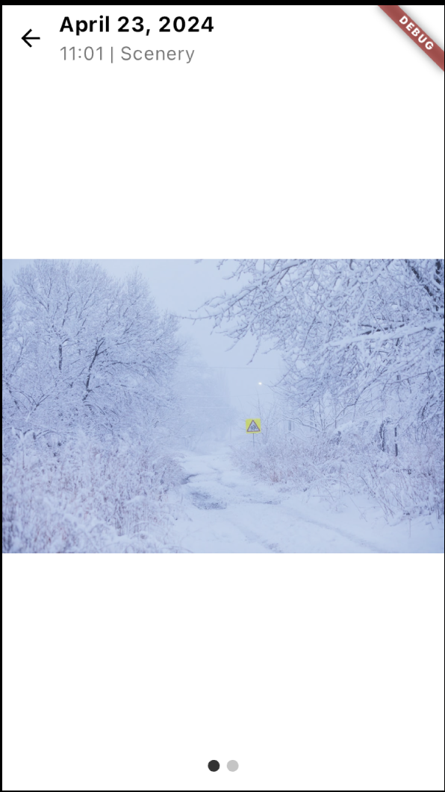
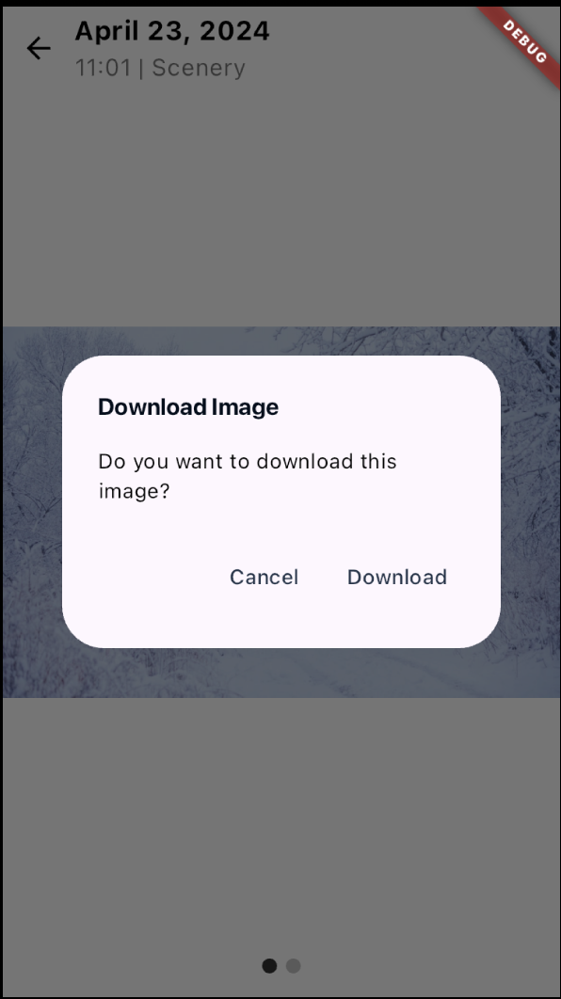
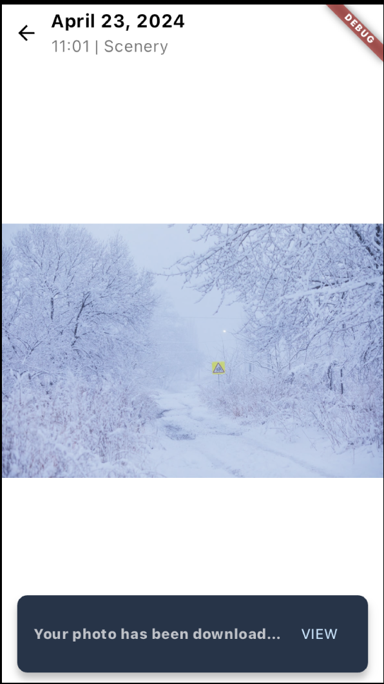
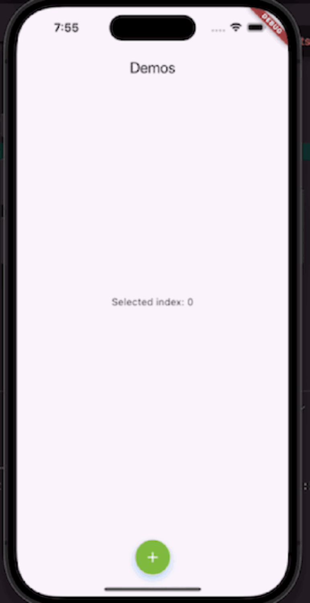

# Multimedia Gallery

## Introduction

A gallery that support image, video and audio with presentable user interface.

## Features

List of features' supported platform
| Features | iOS | Android |
|--------------|--------------------|--------------------|
| Image Viewer | ✅ |✅|
| Video Viewer | ✅ |✅|
| Audio Viewer | ✅ |✅|
| Image List |✅|✅|
| Video List |✅|✅|
| Audio List |✅|✅|
| Next audio | ✅ |✅|
| Next video |✅|✅|
| Next image |✅|✅|
| Download image |✅|✅|

### Main Listing

This feature support:

- Image list
- Video list
- Audio list


### Image Viewer

This feature support:

- Image panning: Drag to pan the image
- Zoom in and out: Zoom in and out by pinching the image
- Light and dark mode detector: Display different UI based on the display mode
- Download image: Long press to download the image
- List indicator: To show the number of image(s) in the list
- Next or previous image: Drag the image to left or right for next or previous image







### Video Viewer

This feature support both device orientation with different user interface.

It also include:
- Device orientation: Display different UI based on device orientation
- Play video: Play and resume video
- Pause video: Pause the video
- Skip next or previous video: Skip to next or previous video
- Replay video: Replay video after the video is completed
- Duration slider: Slide the video slider to desire timestamp


### Audio Viewer

This feature support:

- Play audio: Play and resume audio
- Pause audio: Pause the video
- Skip next or previous audio: Skip to next or previous audio
- Replay audio: Replay audio after the audio is completed
- Duration slider: Slide the audio slider to desire timestamp

https://github.com/AgmoStudioSdnBhd/flutterpack/assets/164973699/6823591b-f8a4-4941-aa29-f6e63f69843d

Feature also include different user interface for different image file type

- Animated image

https://github.com/AgmoStudioSdnBhd/flutterpack/assets/164973699/75b8d71f-4bf9-4009-9264-91868c39757c

- Normal image

https://github.com/AgmoStudioSdnBhd/flutterpack/assets/164973699/371ad321-8945-421e-a106-b7f9e19d5fb4

### Requirements

- Flutter 3.7.0 or higher
- Dart 2.19.0 or higher.

### Usage

#### Main Listing

MainListing can be called to view the variety list of media by inputing the list of audio, image and video as shown in the example below. The parameter for the list is nullable. The required parameter for main listing are:

- List audioList
- List videoList
- List imageList

```import 'dart:convert';

import 'package:flutter/material.dart';
import 'package:flutter/services.dart';
import 'package:multimedia_gallery/multimedia_gallery.dart';

class Listing extends StatefulWidget {
  const Listing({super.key});

  @override
  State<Listing> createState() => _ListingState();
}

class _ListingState extends State<Listing> {
  List audioRes = [];
  List videoRes = [];
  List imageRes = [];

  Future<List> readAudioFile() async {
    String audioList = await rootBundle.loadString('assets/asset/audio.json');
    final audioData = await jsonDecode(audioList);
    final audioJsonList = audioData["audio"];
    setState(() {
      audioRes = audioJsonList;
    });
    return audioRes;
  }

  Future<List> readVideoFile() async {
    String videoList = await rootBundle.loadString('assets/asset/video.json');
    final videoData = await jsonDecode(videoList);
    final videoJsonList = videoData["video"];
    setState(() {
      videoRes = videoJsonList;
    });
    return videoRes;
  }

  Future<List> readImageFile() async {
    String imageList = await rootBundle.loadString('assets/asset/image.json');
    final imageData = await jsonDecode(imageList);
    final imageJsonList = imageData["image"];
    setState(() {
      imageRes = imageJsonList;
    });
    return imageRes;
  }

  @override
  void initState() {
    super.initState();
    WidgetsBinding.instance.addPostFrameCallback((timeStamp) {
      readAudioFile();
      readVideoFile();
      readImageFile();
    });
  }

  @override
  Widget build(BuildContext context) {
    return MainListing(
        audioList: audioRes, videoList: videoRes, imageList: imageRes);
  }
}
```

#### Image Viewer

ImageViewer can be called to view image as shown below. The image path file type will be detected automatically. To use the image viewer, the required paramater is:

- Image model(path, uploadedDate, name)

**example/lib/image_screen.dart**

```
import 'package:flutter/material.dart';
import 'package:multimedia_gallery/multimedia_gallery.dart';

class ImageScreen extends StatelessWidget {
  const ImageScreen({super.key});

  @override
  Widget build(BuildContext context) {
    return Scaffold(
        body: ImageViewer(
      model: ImageModel(
        path: 'assets/images/scenery.jpeg',
        uploadedDate: DateTime.now().toString(),
        name: 'Scenery',
      ),
    ));
  }
}

```

#### Video Viewer

VideoViewer can be called to view video as shown below. The video path is get using video model. The video path is detected automatically.
The required parameters are:

- VideoModel(path,name,uploadedDate)
- selected: The selected index from listing(if listing is used). Default value: 0.

**example/lib/video_screen.dart**

```
import 'package:flutter/material.dart';
import 'package:multimedia_gallery/multimedia_gallery.dart';

class VideoScreen extends StatelessWidget {
  const VideoScreen({super.key});

  @override
  Widget build(BuildContext context) {
    return Scaffold(
        body: VideoViewer(
      model: [
        VideoModel(
            path:
                'https://flutter.github.io/assets-for-api-docs/assets/videos/butterfly.mp4',
            name: 'Butterfly',
            uploadedDate: DateTime.now().toString())
      ],
      selected: 0,
    ));
  }
}

```

### Audio Viewer

AudioViewer can be called to view and listen to audio as shown below. The audio path file type is detect automatically.
The required parameter is:

- AudioModel(path, image, audioName, artistName)
- The selected index from listing(if listing is used). Default value: 0.

**example/lib/audio_screen.dart**

```
import 'package:flutter/material.dart';
import 'package:multimedia_gallery/multimedia_gallery.dart';

class AudioScreen extends StatelessWidget {
  const AudioScreen({super.key});

  @override
  Widget build(BuildContext context) {
    return Scaffold(
        body: AudioViewer(
      model: [
        AudioModel(
          path: 'https://cdn.pixabay.com/audio/2024/03/16/audio_9a03ff5e94.mp3?filename=warm-nights-196465.mp3',
          image: 'assets/images/warm_nights.png',
          audioName: 'Warm Nights',
          artistName: 'xethrocc',
        )
      ],
      selectedIndex: 0,
    ));
  }
}
```
# Expandable Bottom Navigation Bar

A Flutter package that provides an animated expandable bottom navigation bar widget with a center button that expands to show navigation items.




## Compatibility

- Flutter 3.27.0 or higher
- Dart 3.6.1 or higher

## Features

- Initially display with one center button that expands/collapses the bar to show or hide the items when being pressed.
- Customizable colors for selected buttons
- Support for 4 button items in the bar
- Customizable button and shadow colors

## Getting Started

Add this to your package's `pubspec.yaml` file:

```yaml
dependencies:
  expandable_bottom_navbar: ^0.0.1
```

## Usage

```dart
import 'package:expandable_bottom_navbar/expandable_bottom_navbar.dart';

// In your widget:
ExpandableBottomNavBar(
  icons: [
    Icons.home,
    Icons.search,
    Icons.add_circle,
    Icons.notifications,
    Icons.person,
  ],
  onTap: (index) {
    // Handle navigation item tap
  },
  mainButtonColor: Colors.blue,        // Color of the center button
  mainButtonShadowColor: Colors.blue.withValues(alpha: 0.3),  // Shadow color of center button
  backgroundColor: Colors.white,       // Background color of the navigation bar
  selectedItemColor: Colors.blue,      // Color of selected navigation items
  unselectedItemColor: Colors.grey,    // Color of unselected navigation items
  height: 60,                         // Height of the navigation bar
  buttonSize: 60,                     // Size of the center button
)
```

## Properties

- `icons`: List of IconData for navigation items (required)
- `onTap`: Callback function when a navigation item is tapped (required)
- `mainButtonColor`: Color of the center expand/collapse button (optional)
- `mainButtonShadowColor`: Shadow color of the center button (optional)
- `backgroundColor`: Color of the navigation bar background (optional)
- `selectedItemColor`: Color of the selected navigation item (optional)
- `unselectedItemColor`: Color of the unselected navigation items (optional)
- `height`: Height of the navigation bar (optional, defaults to 80.0)
- `buttonSize`: Size of the center button (optional, defaults to 80.0)

## Animation Features

- Smooth expansion/collapse animation
- Icon fade in/out transitions
- Button size animation
- Background opacity animation
- Shadow effects on buttons and background

## Example

Check out the example directory for a complete implementation showing how to:
- Set up the navigation bar
- Handle navigation item taps
- Customize colors and sizes
- Integrate with a Scaffold

## License

This project is licensed under the MIT License - see the LICENSE file for details.
