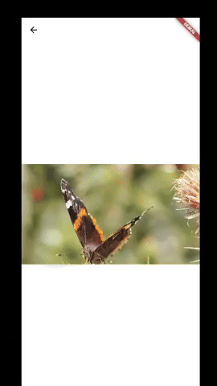
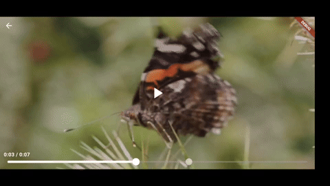

# Multimedia Gallery

## Introduction

A gallery that support image, video and audio with presentable user interface.

## Features

### Image Viewer

This feature support image panning, zoom in and out by pinching the image.

- Zoom In and Out

  

### Video Viewer

This feature support both device orientation with different user interface.

It also include:

- Play video: Able to play and resume video
- Pause video: Able to pause the video
- Duration slider: Able to slide the video to desire timestamp

  
  

### Audio Viewer

This feature include play, pause and seek certain timestamp with presentable user interface.

Feature also include different user interface for different image file type

- Animated image

  

- Normal image

  

### Requirements

- Flutter 3.7.0 or higher
- Dart 2.19.0 or higher.

### Usage

#### Image Viewer

Viewing image

**example/lib/image_screen.dart**

```
import 'package:flutter/material.dart';
import 'package:multimedia_gallery/image/image_viewer.dart';

class ImageScreen extends StatelessWidget {
  const ImageScreen({super.key});

  @override
  Widget build(BuildContext context) {
    return const Scaffold(body: ImageViewer(imageProvider: AssetImage('assets/images/cat_cri.png')));
  }
}
```

#### Video Viewer

Viewing video

**example/lib/video_screen.dart**

```
/// calling [networkVideo] with network url
import 'package:flutter/material.dart';
import 'package:multimedia_gallery/multimedia_gallery.dart';

class VideoScreen extends StatelessWidget {
  const VideoScreen({super.key});

  @override
  Widget build(BuildContext context) {
    return Scaffold(
        body: VideoViewer(path: networkVideo('https://flutter.github.io/assets-for-api-docs/assets/videos/butterfly.mp4')));
  }
}

/// calling [assetVideo] with asset video file
VideoViewer(path: assetVideo('assets/video/butterfly.mp4'))

/// calling [localVideo] with video file located in local directory
VideoViewer(path: localFile('C:/Users/user/documents/butterfly.mp4'))
```

### Audio Viewer

Viewing audio

**example/lib/audio_screen.dart**

```
///calling [networkFile] to play network audio
import 'package:flutter/material.dart';
import 'package:multimedia_gallery/multimedia_gallery.dart';

class AudioScreen extends StatelessWidget {
  const AudioScreen({super.key});

  @override
  Widget build(BuildContext context) {
    return Scaffold(
        body: AudioViewer(
          path: networkFile('https://www.learningcontainer.com/wp-content/uploads/2020/02/Kalimba.mp3'),
          image: const AssetImage('assets/images/cat_cri.png'),
          songName: 'Kalimba',
          artistName: 'Lorem Ipsum lllllllllllllllllllllklmjghklnmkygmdfgfksgdkhgbs')
    );
  }
}

/// calling [assetFile] to play audio file located in assets
AudioViewer(
  path: assetFile('assets/video/Kalimba.mp3'),
  image: const AssetImage('assets/images/cat_cri.png'),
  songName: 'Kalimba',
  artistName: 'Lorem Iplllllllllllllllllllllklmjghklnmkygmdfgfksgdkhgbs');

/// calling [localFile] to play audio file located in local directory
AudioViewer(
  path: localFile('C:/Users/user/video/Kalimba.mp3'),
  image: const AssetImage('assets/images/cat_cri.png'),
  songName: 'Kalimba',
  artistName: 'Lorem Iplllllllllllllllllllllklmjghklnmkygmdfgfksgdkhgbs');
```
