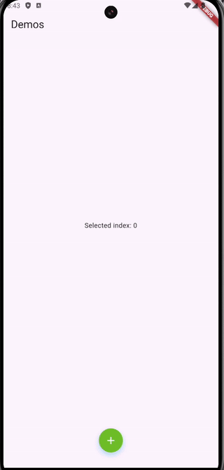

# Expandable Bottom Navigation Bar

A Flutter package that provides an animated expandable bottom navigation bar widget with a center button that expands to show navigation items.




## Compatibility

- Flutter 3.27.0 or higher
- Dart 3.6.1 or higher

## Features

- Initially display with one center button that expands/collapses the bar to show or hide the items when being pressed.
- Customizable colors for selected buttons
- Support for 4 button items in the bar
- Customizable button and shadow colors

## Getting Started

Add this to your package's `pubspec.yaml` file:

```yaml
dependencies:
  expandable_bottom_navbar: ^0.0.1
```

## Usage

```dart
import 'package:expandable_bottom_navbar/expandable_bottom_navbar.dart';

// In your widget:
ExpandableBottomNavBar(
  icons: [
    Icons.home,
    Icons.search,
    Icons.add_circle,
    Icons.notifications,
    Icons.person,
  ],
  onTap: (index) {
    // Handle navigation item tap
  },
  mainButtonColor: Colors.blue,        // Color of the center button
  mainButtonShadowColor: Colors.blue.withValues(alpha: 0.3),  // Shadow color of center button
  backgroundColor: Colors.white,       // Background color of the navigation bar
  selectedItemColor: Colors.blue,      // Color of selected navigation items
  unselectedItemColor: Colors.grey,    // Color of unselected navigation items
  height: 60,                         // Height of the navigation bar
  buttonSize: 60,                     // Size of the center button
)
```

## Properties

- `icons`: List of IconData for navigation items (required)
- `onTap`: Callback function when a navigation item is tapped (required)
- `mainButtonColor`: Color of the center expand/collapse button (optional)
- `mainButtonShadowColor`: Shadow color of the center button (optional)
- `backgroundColor`: Color of the navigation bar background (optional)
- `selectedItemColor`: Color of the selected navigation item (optional)
- `unselectedItemColor`: Color of the unselected navigation items (optional)
- `height`: Height of the navigation bar (optional, defaults to 80.0)
- `buttonSize`: Size of the center button (optional, defaults to 80.0)

## Animation Features

- Smooth expansion/collapse animation
- Icon fade in/out transitions
- Button size animation
- Background opacity animation
- Shadow effects on buttons and background

## Example

Check out the example directory for a complete implementation showing how to:
- Set up the navigation bar
- Handle navigation item taps
- Customize colors and sizes
- Integrate with a Scaffold

## License

This project is licensed under the MIT License - see the LICENSE file for details.
